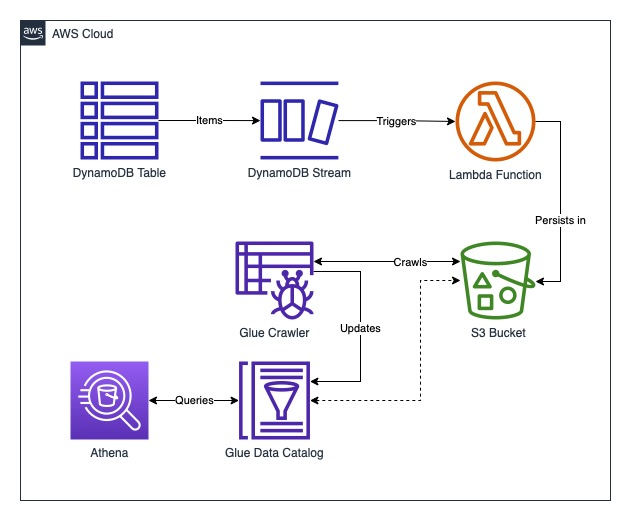

# aws-dynamodb-item-history

This solution demonstrates an example of how the history of DynamoDB items can 
be stored and set up for easy querying. Due to the polymorphic nature of 
DynamoDB items where each item in the table can have a different set of attributes, 
storing the history in a structured store such as a SQL database would not be possible.

One way to accomplish similar querying capabilities whilst still accounting for changing
item structures is to build a solution using S3, Glue Crawlers and Athena.

The first step of this solution is to capture changes from the DynamoDB table and 
persist them in S3. To do this, DynamoDB streams are utilised in order to trigger a 
Lambda function to process batches of changes. These changes can be of `MODIFY`, 
`CREATE` or `DELETE` type. This Lambda function transforms each record depending on 
the type of change. Metadata is also added to help with querying later. After 
transformation the records are stored in S3 as compressed parquet files, an 
optimised format for Athena to read from efficiently. 

The next step is to build Glue Data Catalog tables based on the parquet files that the
Lambda function writes to S3. To do this, we use a Glue Crawler. A crawler scans the
S3 path that is specified and builds tables based on the structure of the files it 
finds. The tables that are created can then be used with Athena to surface the data.

Athena has very few requirements, but in this solution an Athena Workgroup and 
dedicated bucket is created. This ensures that results from any Athena queries are 
stored in the correct way (e.g. encrypted).

This solution is built entirely with infrastructure as code, using the AWS Serverless 
Application Model. AWS SAM documentation can be found [here](docs/aws-sam.md) for 
building and deployment of this solution.

